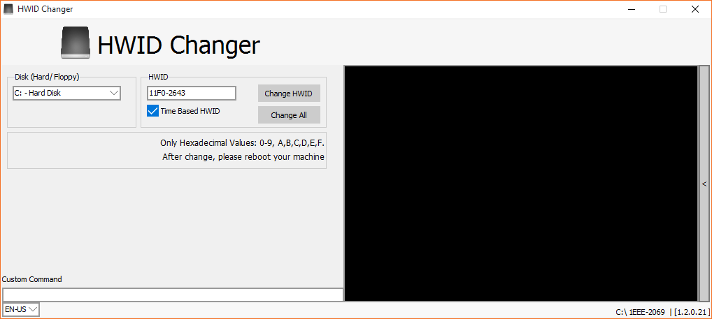

# HWIDChanger
For Windows 7/8/8.1/10!

Change your Hardware ID easily!

Made in Delphi

# Changelog
[1.2.0.21]
* Reworked
* Added 2 Language Packs (Portugues-Brazil/English)
* Added Option to Change Hardware ID of all Disks

[1.1.0.3]
* Redesigned for Windows 10

[1.0.0.2]
* Instant Reboot (Shutdown -r -t 0)
* Translated to English

[1.0.0.1]
* Added Reboot Buttom

[1.0.0.0]
* Initial Release